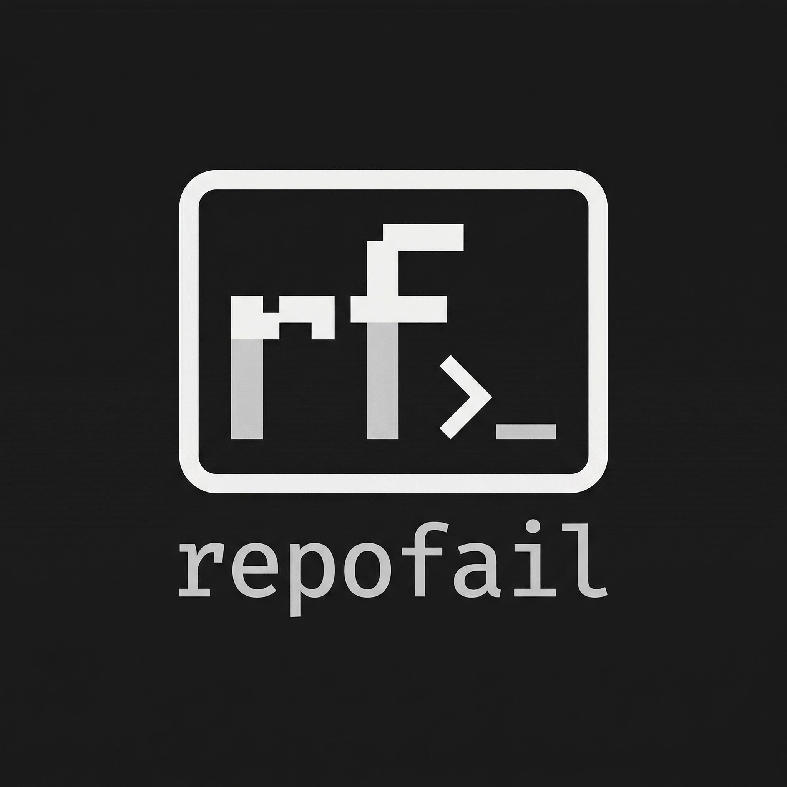
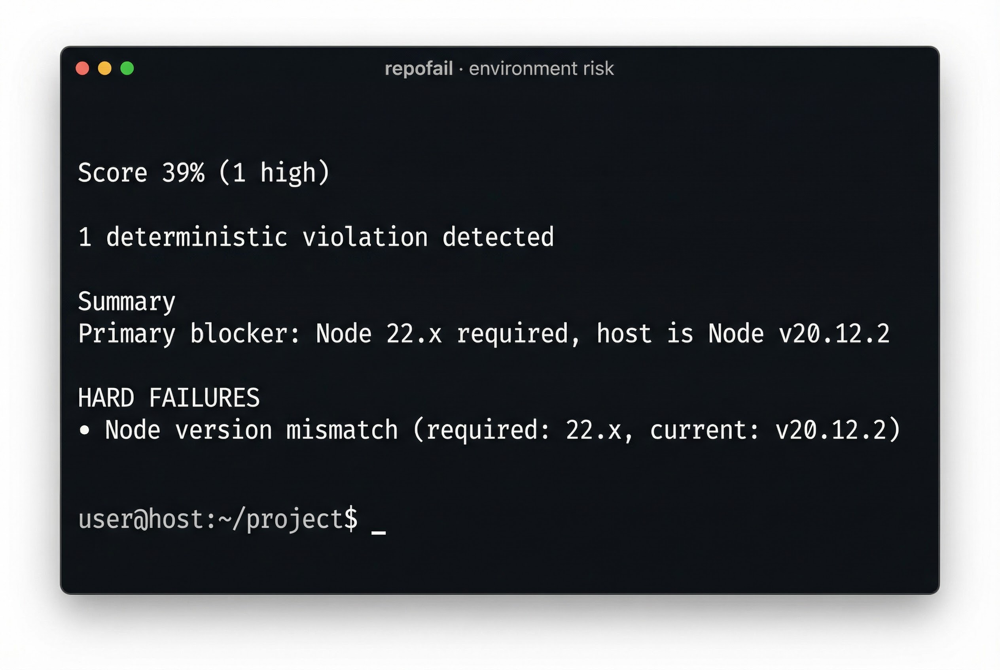

<p align="center">
  
</p>

<h1 align="center">repofail</h1>

<p align="center">
  Deterministic runtime compatibility analyzer
</p>

<p align="center">
  <a href="https://github.com/jayvenn21/repofail/actions">
    
  </a>
  
  
  
</p>

<p align="center">
  <strong>Predict why a repository will fail on your machine before you run it.</strong>
</p>

---

## Why This Exists

Most tools install dependencies.

Few tools tell you:

- Your Node version is wrong.
- Docker targets the wrong architecture.
- CUDA is hardcoded.
- CI and local Python versions drifted.

repofail reads both the repository and your machine — then shows deterministic incompatibilities before install or run.

---

repofail analyzes:

- **The repository** — dependencies, Docker, CI, engines, lock files
- **Your machine** — OS, architecture, toolchain, runtime versions
- **The intersection between them**

Deterministic compatibility rules. No AI. No guessing. No cloud.

**When to run it:** After clone (before `make install`), in CI, or when debugging "works on my machine."

---

## Try It

```bash
git clone https://github.com/Significant-Gravitas/AutoGPT
cd AutoGPT
repofail
```

Or scan any local repo:

```bash
repofail /path/to/any/repo
```

---

## Install

```bash
pip install -e .
```

## Quick start

```bash
repofail                    # From repo root
repofail --json             # Machine-readable
repofail --ci               # CI (exit code from score / severity)
```

## Screenshot

<p align="center">
  
</p>

---

## Example output

```
┌──────────────────────────────────────────────────────────────────────┐
 repofail · environment risk
────────────────────────────────────────────────────────────────────────
 Score    39%  (1 high)
 1 deterministic violation detected.
 Summary  Primary blocker: Node 22.x required, host is Node v20.12.2.
────────────────────────────────────────────────────────────────────────
 HARD FAILURES
  ● Node engine constraint violated.
  package.json requires: node 22.x
  Host: node v20.12.2
  Determinism: 1.0 (spec violation)
  Likely error: npm ERR! code EBADENGINE / runtime version mismatch
  Suggested fix:
    nvm install 22  # or fnm, n
    nvm use 22
────────────────────────────────────────────────────────────────────────
 Run with --json for machine output  ·  --ci for exit codes
└──────────────────────────────────────────────────────────────────────┘
```

**Real examples:** AutoGPT (Node 22.x required) → 39% · browser-use (Docker amd64 on Apple Silicon) → 48% · chopchop → 96%, clean.

## Why repofail Is Different

| Tool | Reads Repo | Inspects Host | Predicts Failure | CI Enforceable |
|------|------------|---------------|------------------|----------------|
| pip | ✅ | ❌ | ❌ | ❌ |
| Docker | ✅ | ❌ | ❌ | ❌ |
| env diff | ❌ | ❌ | ❌ | ❌ |
| AI assistant | ⚠️ | ❌ | ❓ | ❌ |
| **repofail** | ✅ | ✅ | ✅ | ✅ |

## Design Principles

- **Deterministic** — not heuristic AI guesses
- **Evidence-based** — file:line, host version, engine spec
- **Offline by default** — no calls home
- **Scored** — weighted compatibility risk
- **CI-first** — exit codes are meaningful

---

## Demo examples

**CUDA** (ML repos)
```
  ● Hard-coded CUDA execution path detected
  Found model.to("cuda") in trainer.py:32
  Host has no CUDA device
  Determinism: 1.0
  Likely error: RuntimeError: CUDA error: no CUDA-capable device is detected
```

**Apple Silicon Docker**
```
  ● Docker targets amd64, host is arm64
  Dockerfile uses --platform=linux/amd64
  Host: macOS arm64
  Determinism: 1.0
  Likely error: qemu emulation required / performance degradation
```

**Spec drift**
```
  ● Spec drift — 3 distinct Python targets across configs
  Drift entropy: 3 distinct interpreter targets
  CI and local runtime definitions diverge
```

---

## Rule categories

| Category | Examples |
|----------|----------|
| `spec_violation` | Python version outside range, torchao/torch mismatch |
| `hardware_incompatibility` | CUDA required, low RAM, MLX scaling |
| `toolchain_missing` | No compiler, Rust, node-gyp on Windows |
| `runtime_environment` | Port collision, Docker-only, multi-service RAM |
| `architecture_mismatch` | Apple Silicon x86-only wheels |

## Scoring model

**Compatibility Score** = `100 - Σ(weight × confidence × determinism)`

| Severity | Weight | Determinism |
|----------|--------|-------------|
| HIGH | 45 | 1.0 for spec violations |
| MEDIUM | 20 | 0.8–1.0 |
| LOW | 7 | 0.5–1.0 |
| INFO | 5 | structural only |

**Determinism scale:** `1.0` = guaranteed failure · `0.75` = high likelihood · `0.6` = probabilistic (spec drift) · `0.5` = structural risk

Score floors at 10%. When score ≤15% with HIGH rules: "— fatal deterministic violations present".

## Commands

| Command | What it does |
|---------|--------------|
| `repofail` | Scan current dir |
| `repofail -p /path` | Scan specific repo |
| `repofail -j` | JSON output |
| `repofail --ci` | CI mode: exit 1 if HIGH rules fire |
| `repofail gen .` | Generate env contract |
| `repofail check <file>` | Validate host against contract |
| `repofail a [path]` | Audit: scan all repos in directory |
| `repofail sim [path] -H <file>` | Simulate on target host |
| `repofail -e list` | List all rules |
| `repofail -e spec_drift` | Explain a rule |

## What It Does — Rules

| Rule | Severity | When |
|------|----------|------|
| Torch CUDA mismatch | HIGH | Hard-coded CUDA, host has no GPU |
| Python version violation | HIGH | Host outside `requires-python` range |
| Python EOL | HIGH | requires-python pins to 3.7 or 3.8 |
| Spec drift | HIGH | pyproject vs Docker vs CI — inconsistent Python |
| Node engine mismatch | HIGH | package.json engines.node vs host |
| Lock file missing | HIGH | package.json has deps, no lock file |
| Apple Silicon wheel mismatch | MEDIUM/HIGH | arm64 + x86-only packages or Docker amd64 |
| ... | | See `repofail -e list` |

Each result includes **evidence** (file:line, host version) for auditability.

---

## CI integration

```yaml
- uses: actions/checkout@v4
- uses: actions/setup-python@v5
  with:
    python-version: "3.12"
- run: pip install repofail
- run: repofail --ci
```

Exits 1 if HIGH rules fire. Use `--fail-on MEDIUM` to be stricter.

**Explain rules:** `repofail --explain spec_drift`

## Fleet audit

```bash
repofail a /path/to/monorepo         # Scan all repos
repofail sim . -H prod-host.json     # Pre-deploy: would this work on prod?
```

## Architecture

```
repofail/
  cli.py
  engine.py
  scanner/         # Repo + host inspection
  rules/           # Deterministic rule implementations
  fleet.py         # Audit, simulate
```

Extensible via `.repofail/rules.yaml`.

---

## Runs anywhere

| Aspect | How |
|--------|-----|
| **OS** | macOS, Linux, Windows |
| **Python** | 3.10+ |
| **Network** | Zero — fully offline |
| **Install** | `pip install repofail` (when on PyPI) |

## Testing

```bash
pytest tests/ -v
```
