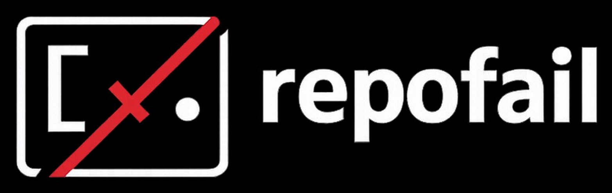

<p align="center">
  
</p>

<h1 align="center">repofail</h1>

<p align="center">
  Deterministic runtime compatibility analyzer
</p>

<p align="center">
  
  
  
  
</p>

<p align="center">
  Predict why a repository will fail on your machine before you run it.
</p>

<p align="center">
  <em>repofail answers one question: <strong>Will this repository actually run here?</strong><br>
  It inspects both the repo and your machine — then reports deterministic incompatibilities before you install anything.</em>
</p>

<p align="center">
  <a href="#why-this-exists">Why</a> ·
  <a href="#example-output">Example</a> ·
  <a href="#works-on">Works on</a> ·
  <a href="#install">Install</a> ·
  <a href="#usage">Usage</a> ·
  <a href="#rules">Rules</a> ·
  <a href="#ci-integration">CI</a> ·
  <a href="#contracts">Contracts</a>
</p>

---

## Why This Exists

Most tools install dependencies.

Few tools tell you:

- Your Node version violates `engines.node`.
- Docker targets the wrong architecture.
- CUDA is hard-coded with no fallback.
- CI and local Python versions drifted.

repofail inspects both the repository and your machine — then reports deterministic incompatibilities before install or runtime.

---

## Works on

repofail works on:

- Python projects
- Node projects
- Dockerized repos
- ML repositories
- Monorepos

Run it against any local clone.

---

## Example output

<p align="center">
  
</p>

repofail surfaces deterministic failures before install or runtime. No heuristics. No AI guesses. Evidence only.

---

## Install

```bash
pip install -e .
```

## Usage

```bash
# Scan
repofail                    # Scan current dir
repofail -p /path/to/repo   # Scan specific repo
repofail -j                 # JSON output (machine-readable)
repofail -m                 # Markdown output
repofail -v                 # Verbose: rule IDs and low-confidence hints
repofail --ci               # CI mode: exit 1 if HIGH rules fire
repofail --fail-on MEDIUM   # CI: fail on MEDIUM or higher (default: HIGH)
repofail -r                 # Save failure report when rules fire (opt-in telemetry)

# Rules
repofail -e list            # List all rules
repofail -e spec_drift      # Explain a rule

# Contracts
repofail gen .              # Generate env contract to stdout
repofail gen . -o contract.json
repofail check contract.json

# Fleet
repofail a /path            # Audit: scan all repos in directory
repofail a /path -j         # Audit with JSON output
repofail sim . -H host.json # Simulate: would this work on target host?
repofail s                  # Stats: local failure counts (from -r reports)
repofail s -j               # Stats with JSON output
```

---

## CI integration

```yaml
- uses: actions/checkout@v4
- uses: actions/setup-python@v5
  with:
    python-version: "3.12"
- run: pip install repofail
- run: repofail --ci
```

Exits 1 if HIGH rules fire. Use `--fail-on MEDIUM` to be stricter.

## Contracts

```bash
repofail gen . -o contract.json
repofail check contract.json
```

Versioned runtime expectations. Teams share contracts. CI checks drift.

---

## Rules

| Tool | Reads Repo | Inspects Host | Predicts Failure | CI Enforceable |
|------|------------|---------------|------------------|----------------|
| pip | ✅ | ❌ | ❌ | ❌ |
| Docker | ✅ | ❌ | ❌ | ❌ |
| **repofail** | ✅ | ✅ | ✅ | ✅ |

**Deterministic rule coverage** — repofail includes checks across:

- **Spec violations** — version ranges, engines.node, requires-python
- **Architecture mismatches** — Apple Silicon vs amd64 Docker
- **Hardware constraints** — CUDA requirements, GPU memory
- **Toolchain gaps** — missing compilers, Rust, node-gyp
- **Runtime drift** — CI vs Docker vs local inconsistencies
- **Environment shape** — multi-service RAM pressure, port collisions

See all rules: `repofail -e list` · Explain one: `repofail -e <rule_id>`

<details>
<summary>Rule reference</summary>

| Rule | Severity | When |
|------|----------|------|
| Torch CUDA mismatch | HIGH | Hard-coded CUDA, host has no GPU |
| Python version violation | HIGH | Host outside `requires-python` range |
| Spec drift | HIGH | pyproject vs Docker vs CI — inconsistent Python |
| Node engine mismatch | HIGH | package.json engines.node vs host |
| Lock file missing | HIGH | package.json has deps, no lock file |
| Apple Silicon wheel mismatch | MEDIUM/HIGH | arm64 + x86-only packages or Docker amd64 |
| … | | `repofail -e list` |

</details>

<details>
<summary>Scoring model</summary>

**Compatibility Score** = `100 − Σ(weight × confidence × determinism)`

| Severity | Weight | Determinism |
|----------|--------|-------------|
| HIGH | 45 | 1.0 for spec violations |
| MEDIUM | 20 | 0.8–1.0 |
| LOW | 7 | 0.5–1.0 |
| INFO | 5 | structural only |

**Determinism scale:** `1.0` = guaranteed failure · `0.75` = high likelihood · `0.6` = probabilistic (spec drift) · `0.5` = structural risk

Score floors at 10%. When score ≤15% with HIGH rules: "— fatal deterministic violations present".

</details>

---

## Architecture

```
repofail/
  cli.py
  engine.py
  scanner/         # Repo + host inspection
  rules/           # Deterministic rule implementations
  fleet.py         # Audit, simulate
```

Extensible via `.repofail/rules.yaml`.

---

## Testing

```bash
pytest tests/ -v
```
